# Whack-A-Mole

## Introduction
This is a Whack a Mole game where you can play a cool game of Whack-a-mole. It's made to be attractive for the user and provide some fun for both first time players and veterans. 

[View the live project here](https://bjornrodin.github.io/whac-a-mole/)

[Link to Github Repository](https://github.com/BjornRodin/whac-a-mole)

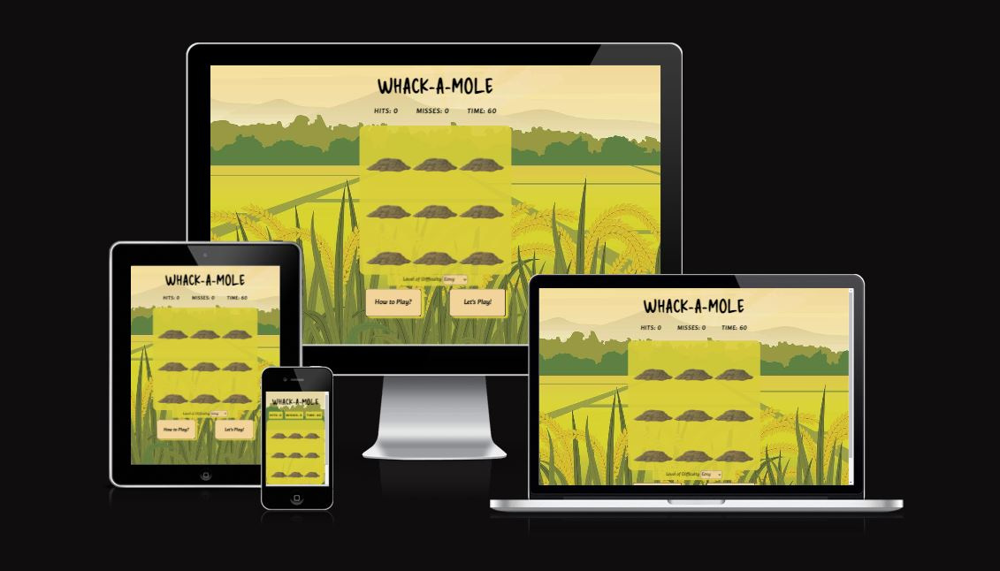

## Table of Content
- [Introduction](#introduction)
- [User Experience (UX)](#user-experience-ux)
    - [User Stories](#user-stories)
        - [First Time Visitor Goals](#first-time-visitor-goals)
        - [Returning Visitor Goals](#returning-visitor-goals)
        - [Administrators](#administrators)
    - [Design](#design)
        - [Color Scheme](#color-scheme)
        - [Fonts](#fonts)
        - [Images](#images)
        - [Wireframes](#wireframes)
- [Features](#features)
    - [Existing Features](#existing-features)

    - [Future Features](#future-features)
- [Testing](#testing)
    - [User Stories Testing](#user-stories-testing)
       - [As a first time visitor I want to quickly understand where to find the rules](#as-a-first-time-visitor-i-want-to-quickly-understand-where-to-find-the-rules)
       - [As a first time visitor I want to know where to start the game](#as-a-first-time-visitor-i-want-to-know-where-to-start-the-game)
       - [As a first time visitor I want to see what my score is and how much time I have left](#as-a-first-time-visitor-i-want-to-see-what-my-score-is-and-how-much-time-i-have-left)
       - [As a returning visitor I want to be able to chose difficulty and change it easily](#as-a-returning-visitor-i-want-to-be-able-to-chose-difficulty-and-change-it-easily)
       - [As a returning visitor I want to have feedback on my performance so I can challenge myself](#as-a-returning-visitor-i-want-to-have-feedback-on-my-performance-so-i-can-challenge-myself)
       - [As a returning visitor I want to be able to quickly restart the game when it's over](#as-a-returning-visitor-i-want-to-be-able-to-quickly-restart-the-game-when-its-over)
       - [As a returning visitor I want to have a calm background and game with pleasing design](#as-a-returning-visitor-i-want-to-have-a-calm-background-and-game-with-pleasing-design)
       - [As a administrator I want to provide the users with a game that is easy to navigate](#as-a-administrator-i-want-to-provide-the-users-with-a-game-that-is-easy-to-navigate)
       - [As a administrator I want to provide simple functions to not overcomplicate things](#as-a-administrator-i-want-to-provide-simple-functions-to-not-overcomplicate-things)
       - [As a administrator I want to provide a design and feedback that is fun and engages with the user](#as-a-administrator-i-want-to-provide-a-design-and-feedback-that-is-fun-and-engages-with-the-user)
    - [Automated Testing](#automated-testing)
        - [W3C Markup Validation Service](#w3c-markup-validation-service)
        - [W3C CSS Validation Service](#w3c-css-validation-service)
        - [JSHint Javascript Validator](#jshint-javascript-validator)
        - [Google Lighthouse Performance Test](#google-lighthouse-performance-test)
            - [Warnings](#warnings)
    - [Manual Testing](#manual-testing)
        - [Features Test](#features-test)
        - [Browser](#browser)
        - [Responsiveness](#responsiveness)
- [Bugs](#bugs)
- [Technologies](#technologies)
- [Deployment](#deployment)
    - [Deployment Github Pages](#deployment-github-pages)
    - [Cloning Repository](#cloning-repository)
    - [Open Cloned Repository](#open-cloned-repository)
    - [Version Control](#version-control)
- [Credits](#credits)
    - [Media](#media)
    - [Code](#code)
- [Acknowledgements](#acknowledgements)

## User Experience (UX)

### Introduction
The goal for this website is to provide people with a fun game to spend some time but not having to invest hours upon hours of gametime. Play the game wherever you are and whenever you feel like it. You have three levels to chose between so if you are a new player or a veteran you should still find it challenging if you want to. During the game the scoreboard will be updated depending if you miss or hit the mole, if the mole is hit it will rotate to indicate that you have hit. When the game is over you will be presented with your score and some feedback about how well you have performed.
Enjoy!

### User Stories

#### First Time Visitor Goals
As a first time visitor I want to:
- quickly understand where to find the rules.
- know where to start the game.
- see what my score is and how much time I have left.

#### Returning Visitor Goals
As a returning visitor I want to:
- be able to chose difficulty and change it easily.
- have feedback on my performance so I can challenge myself.
- be able to quickly restart the game when it's over.
- have a calm background and game with pleasing design.

#### Administrators
As a administrator I want to:
- provide the users with a game that is easy to navigate.
- provide simple functions to not overcomplicate things.
- provide a design and feedback that is fun and engages with the user.

### Design

#### Color Scheme
The colors was extracted from the "background-field.jpg" image.
- #D9CE3B  was used as background color for the mole-area, level-difficulty, error-page and for game-info on smaller screen-sizes. It was also used as a subtle shadow for the buttons how-to-play and play-game.
- #F2D49B  was used as background color for buttons across the website.

#### Fonts
The fonts that are used are from [Google Fonts](https://fonts.google.com/). The header has "Delicious Handrawn" to provide a playfullness to the game that fits the nature of the game itself. The rest of the site use "Alkatra" to keep the playfullness but still being easy to read for the user. Both have Sans-Serife as a fallback font.

#### Images
The images used are taken from the following sites:
- [Pixabay](https://pixabay.com/) which is a site that provides images that are free to use.
    - In this case I took the image "pileofdirt.png" from the the user [OpenClipart-Vectors](https://pixabay.com/users/openclipart-vectors-30363/?utm_source=link-attribution&amp;utm_medium=referral&amp;utm_campaign=image&amp;utm_content=576447).
- [IMGBIN](https://imgbin.com/) which also is a site that provides images that are free to use.
    - In this case I took the image "molefigure.png" from the user [FireDoidaum](https://imgbin.com/user/FireDoidaum).
- [Vecteezy](https://www.vecteezy.com/) which also is a site that provides images that are free to use.
    - In this case i took the image "background-field.png" from the user [annieart0](https://www.vecteezy.com/members/annieart0).

#### Wireframes
To create the general idea of the site [Balsamiq](https://balsamiq.com/) was used to create the wireframes. The end-product is pretty close to the initial idea, the biggest change was that "How to play" was moved to where the "Restart" button was planned (as we don't really need a restart-button thanks to the coding) and because some popups was implemented instead. In the "gameOver" function a popup was made where a "Play again" button is added, so there still is a type of restart-button.

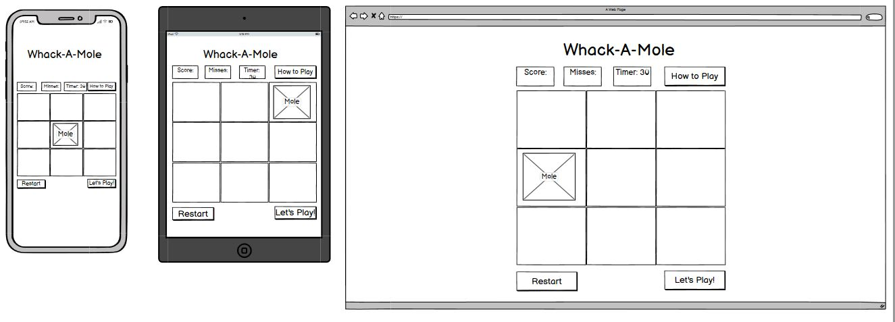

## Features

### Existing Features
- The game-info is presented as the page is loaded to give the user clear information that there is going to be information presented in that area when the game is running.This area is updated as the game is running to give the user real-time feedback.
    
    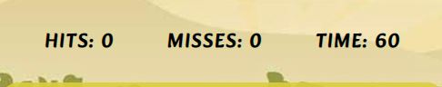
- The mole-area is presented with 9 squares, all with a pile of dirt in them to clearly show the user where the game-area is and where to expect the mole to appear. Directly under the level of difficulty is shown for the user to chose as they please.

    
- The control-area is from where the user can either click on a button to read the rules or start the game.

    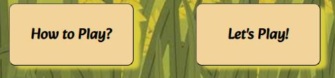
    
    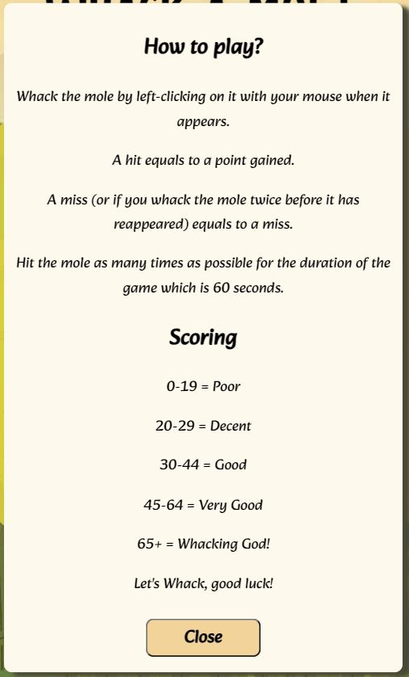
- When the game has finished the user is presented with a popup-window with a message that changes depending on how well the user performed, their score clearly visible, a question if they want to play again and then the corresponding buttons to either play again or close the popup-window to change the difficulty settings.

    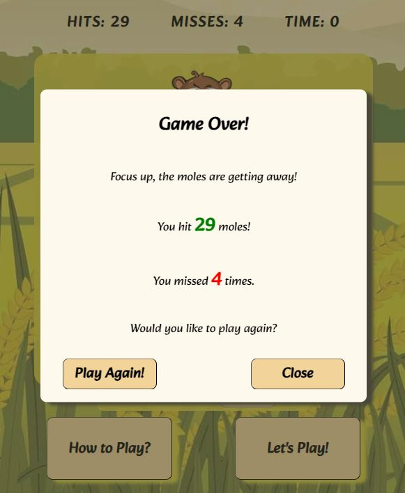

- A 404.html is also added in case it's needed, the page has styling similar to the index.html and a return button to go back to the game instead of having to press the return button in the browser.

    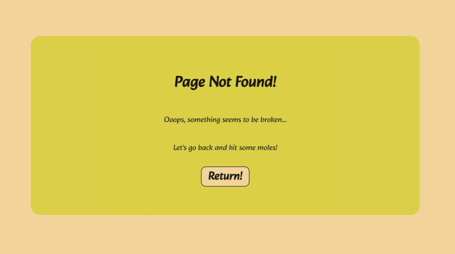

### Future Features
- Adding a Highscore scoreboard.
- More custom messages for the gameover popup.
    - Chosen randomly depending on what level of difficulty the user is playing and what score they got.
    - Also adding another message depending on how many moles that are missed.
- Counting the moles that are getting away, right now we calculate if the user hit or miss the mole or not but not the moles that are getting away so to speak.
- In the gameover popup the total number of appeared moles could be presented (as it changes due to the random calculation for how long the mole is visible).
- Making the user able to change the gametime between 30 or 60 seconds depending if they want a shorter game or not. 
- Adding sound to the game.
- When the game is started the user could be presented with a short countdown from 3 to be even more ready when the game actually start running.

## Testing

### User Stories Testing

#### As a first time visitor I want to quickly understand where to find the rules
- As soon as the page is loaded the user can easily see the button "How to Play?".
- When hovering above the button it changes background-color to indicate the user can click on it.
- When clicked the rules pops up and is presented in a clear fashion and also show what the different scores mean.

#### As a first time visitor I want to know where to start the game
- As soon as the page is loaded the user can easily see the button "Let's Play!".
- When hovering above the button it changes background-color to indicate the user can click on it.

#### As a first time visitor I want to see what my score is and how much time I have left
- Above the mole-area the user from the very beginning can see their hits, misses and how much time they got.
- All the information is updated in real time so the user always can see how they are doing, both with the scores but also regarding how much time they have left.

#### As a returning visitor I want to be able to chose difficulty and change it easily
- Directly above the "How to Play?" and "Let's Play!" buttons the user is presented with a dropdown to choose their prefered difficulty, as standard "Easy" is preselected on page-load. 

#### As a returning visitor I want to have feedback on my performance so I can challenge myself
- When the game is over the user is presented with a popup that gives the user a short message regarding their performance, the score is also presented. Hence they know how well they performed and if they want to they can try to beat the score by either clicking "Play again" or closing the popup to change the level of difficulty before starting again.

#### As a returning visitor I want to be able to quickly restart the game when it's over
- On the popup when the game is over there is a button "Play again" the user can click to restart the game with the same settings as before.

#### As a returning visitor I want to have a calm background and game with pleasing design
- The background gives a "cartoonish" feeling with calm colors and also a sense of relevancy (farmers don't want moles in their fields).
- There is no really bright colors and it is clear that the only thing the user can interact with is the grid and the buttons below.
- The mole itself look like he is jumping up from the piles of dirt and also brings the "cartoonish" feeling. When the mole is hit it rotates to the left to indicate that it was hit.

#### As a administrator I want to provide the users with a game that is easy to navigate
- When the website loads the users are clearly presented with the name of the game, a game-info area, a game-area and a control-area.
- Over the game, control-areas and buttons the cursor turns into a pointer to indicate the user can interact with the area.
- When hovering above buttons the background color changes to indicate even further that the user can click on them.

#### As a administrator I want to provide simple functions to not overcomplicate things
- Except for the "How to Play?" and "Let's Play!" buttons the user can only choose what level of difficulty they want to play. And if the user don't want to change the settings then they can click "Let's Play!" right away and the game will start.

#### As a administrator I want to provide a design and feedback that is fun and engages with the user
- The game is designed to be "cartoonish" so the user clearly can see that it is a game and not made to be realistic.
- Feedback like the mole rotating to the left when being hit aswell as the game-info area is made to engage with the user during the game in a clear fashion.
- When the game is ended the user are presented with their score and a message about their performance, hopefully to make them play again and again.

### Automated Testing

#### W3C Markup Validation Service
- index.html
    - Result
        - According to the image below there is no errors or warnings to show.

    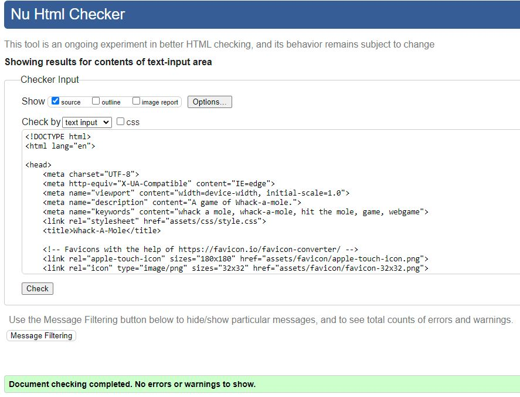
- 404.html
    - Result
        - According to the image below there is no errors or warnings to show.

    

#### W3C CSS Validation Service
- style.css
    - Result
        - According to the image below there is no errors to show.
        - According to the image below there is a few warnings to show, more about those under "Warnings".

    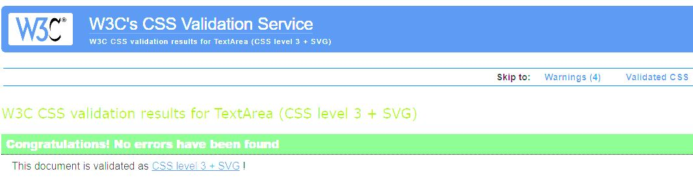

    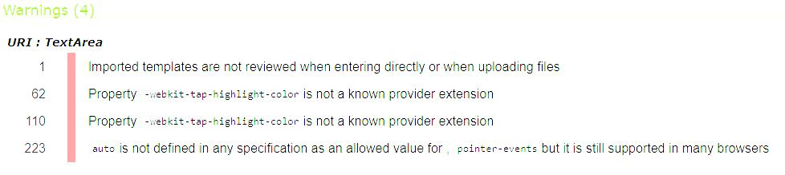

#### JSHint Javascript Validator
- script.js
    - Result
        - According to the image below there is no errors or warnings.

    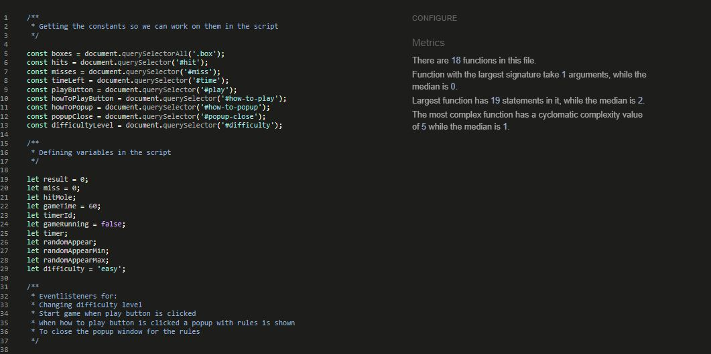

#### Google Lighthouse Performance Test
The tests are all made in the same way:
1. In incognito-mode
2. The same configuration is used, showed in below image. Only 'Device' was changed in between the tests.
    
    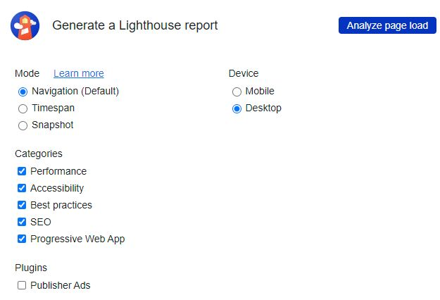

- Desktop

    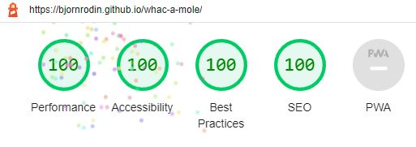
- Mobile

    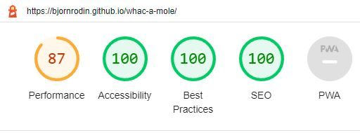

#### Warnings
- CSS Warnings
    - The first warning is just that the W3C validator can't validate the imported style sheet. So it's fine to leave it as it is.
        - Source: [Stackoverflow](https://stackoverflow.com/questions/25946111/importing-css-is-ending-up-with-an-error)
    - The second and third warning is only a "heads-up" that they might not be working on older browsers. According to this [source](https://stackoverflow.com/questions/52490004/what-are-all-of-these-w3c-css-validation-warnings-about) it is fine to leave these aswell.
    - The fourth warning is another "heads-up" that it might not be supported on certain browsers. However, according to this [source](https://stackoverflow.com/questions/41406627/css-pointer-events-and-appearance-properties-not-recognized-by-css-validator) this happens because the property hasn't yet achieved a high official status in the W3C validator but is nonetheless supported by major browsers. So I will leave it.

### Manual Testing
Tested according to below image and passing everything.

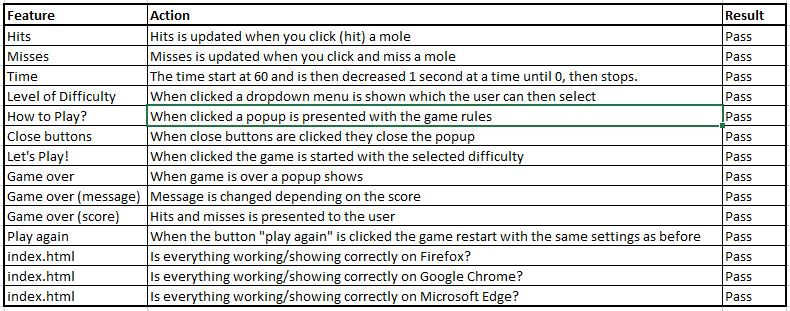

#### Responsiveness
All the pages was tested with different screen sizes through Developer Tools in the Google Chrome Browser. Below is also a link to 'amiresponsive' where it is also possible to see how the site look on different screen sizes at the same time.

[Am I Responsive?](https://ui.dev/amiresponsive?url=https://bjornrodin.github.io/whac-a-mole/)

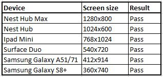

## Bugs
- One of the more major bugs I encountered was to make the mole rotate to one side whenever it was hit. For the better part of the project I let it be but in the end I really wanted to solve the issue. The issue was that whenever I tried adding another background image or rotate the existing mole it either totaly overid the existing backgrounds or the image was distorted. After much trial and error I got it working.
- When adding the difficulty selecting feature the mole kept running the same speed  even though another level was set. It took a while for me to realize to add the variables into the randomBox function aswell so it actually changed the speed depending on what the user is choosing. Now it works.

## Technologies
- [HTML](https://en.wikipedia.org/wiki/HTML) was used as the main language for the project.
- [CSS](https://en.wikipedia.org/wiki/CSS) was used to style the HTML elements.
- [Code Institute Template](https://github.com/Code-Institute-Org/gitpod-full-template) was used during this project.
- [GitHub](https://github.com/) is the host which is used to store the code.
- [Git](https://git-scm.com/) was used to commit and push the code to the GitHub repository and works as a version control software. 
- [Balsamiq](https://balsamiq.com/) was used to create the wireframes.
- [Google Fonts](https://fonts.google.com/) was used to import the fonts that was used.
- [Google Chrome Developer Tools](https://developer.chrome.com/docs/devtools/overview/) was used during the whole project, especially while debugging and making it responsive for different screen-sizes.
- [W3C HTML Validator](https://validator.w3.org/) was used to check for errors in the HTML code in the end of the project.
- [W3C CSS Validator](https://jigsaw.w3.org/css-validator/) was used to check for errors in the CSS code in the end of the project.
- [JSHint Javascript Validator](https://jshint.com/) was used to check for errors in the JavaScript code.
- [Google Chrome Lighthouse](https://developers.google.com/web/tools/lighthouse) was used when testing the site.
- [W3C School](https://www.w3schools.com/) was used to aid in coding.
- [Pixabay](https://pixabay.com/) was used to find images for the site.
- [IMGBIN](https://imgbin.com/) was used to find images for the site.
- [Vecteezy](https://www.vecteezy.com/) was used to find images for the site.
- [Adobe Color](https://color.adobe.com/sv/create/image) was used to extract colors from the 'background-field.jpg' image.
- [My ColorSpace](https://mycolor.space/) Was used to find matching colors for those extracted in Adobe Color.
- [Contrast Grid](https://contrast-grid.eightshapes.com/) Was used to see how the different color would contrast against black and white texts.
- [RedKetchup Image Resizer](https://redketchup.io/image-resizer) was used to resize images to improve performance.
- [Am I Responsive](https://ui.dev/amiresponsive?url=https%3A%2F%2Fbytes.dev) was used to give the reader a quick and easy way to see the responsiveness of the site and also to have a image for the introduction of the Readme.md.
- [Favicons](https://favicon.io/) was used to add a favicon to the browser.

## Deployment 

### Deployment Github Pages
1. Navigate to the [repository](https://github.com/BjornRodin/programmers-meetup-hub)
2. Click on 'Settings' (found in the top/middle of the page).
3. Click on 'Pages' in the menu on the left which will open 'GitHub Pages'.
4. From the dropdown menu 'Source' under the header 'Build and Deployment', select 'Deploy from a Branch'.
5. From the dropdown menu under 'Branch', select 'main' and the folder to the right to 'root'. 
6. Click Save.
7. The page should refresh and the deployment link should appear above 'Build and deployment'.

### Cloning Repository
1. Navigate to the [repository](https://github.com/BjornRodin/programmers-meetup-hub)
2. Click on the 'Code' button on top of the repository and copy the HTTPS link. 
3. Open Git Bash
4. Type 'git clone' and then paste or type the link.
5. Press Enter
The project is now cloned.

### Open Cloned Repository
1. After cloning, type 'ls' and hit 'enter' to locate your repository on your computer.
2. Locate the folder on your computer.
3. Open the folder and double-click the 'index' file to open.

### Version Control
- A repository was made on Github with Code Institutes Template.
- Coding for the site was done on the [Gitpod](https://www.gitpod.io/) platform.
- Code was added to the staging area with the 'git add .' command.
- The changes in the staging area was committed with the 'git commit -m " "' command.
- All committed code was pushed to Github repository with the 'git push' command.

## Credits
### Media
All pictures was downloaded from these three websites, the authors are also included.
- [Pixabay](https://pixabay.com/)
    - In this case I took the image "pileofdirt.png" from the the user [OpenClipart-Vectors](https://pixabay.com/users/openclipart-vectors-30363/?utm_source=link-attribution&amp;utm_medium=referral&amp;utm_campaign=image&amp;utm_content=576447).
- [IMGBIN](https://imgbin.com/)
    - In this case I took the image "molefigure.png" from the user [FireDoidaum](https://imgbin.com/user/FireDoidaum).
- [Vecteezy](https://www.vecteezy.com/)
    - In this case i took the image "background-field.png" from the user [annieart0](https://www.vecteezy.com/members/annieart0).

### Code
- The code that was used in the project was mostly learnt via [Code Institute](https://codeinstitute.net/se/) and their Full Stack Software Development course.
- [W3 School](https://www.w3schools.com/) was mostly used to solve issues or alternate ways to do the coding.

### Content
- The content was designed and written by me.

## Acknowledgements
- Thank you to my family, especially Joakim Rödin, who have supported, pushed and encouraged me during the project.
- Gratitude to my mentor Jack Wachira for the support he has given me.
- The Slack community.